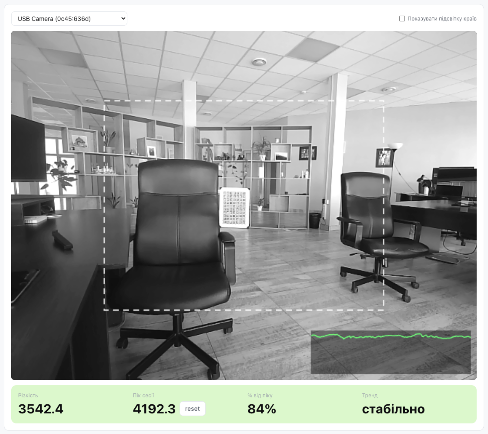

# Focus Peaking

A browser-based focus peaking tool for manually focusing cameras/webcams — no app install, just open it in a tab next to your camera feed.

It reads your camera through `getUserMedia`, computes a live sharpness score (Laplacian variance over a downscaled center region of interest), and shows:

- **Sharpness** — current score, smoothed (EMA)
- **Session peak** — highest score seen since start/reset
- **% of peak** — how close the current frame is to that peak, also reflected in the background color (red → orange → yellow → green)
- **Trend** — rising / falling / stable / "near peak"
- **Edge highlighting** — in-focus edges overlaid in green directly on the video, toggleable
- A small on-canvas history sparkline of the last few seconds

Supports multiple connected cameras (pick from a dropdown) and has a UK/EN language switch.



## Run locally

```
npm install
npm run dev
```

Open the printed local URL, grant camera access, and pick a camera from the dropdown if you have more than one.
